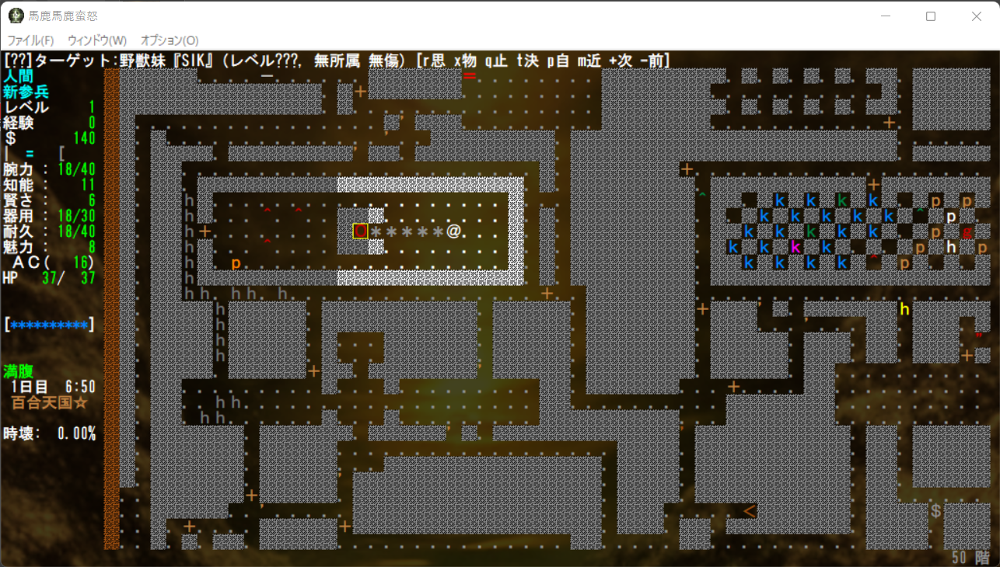
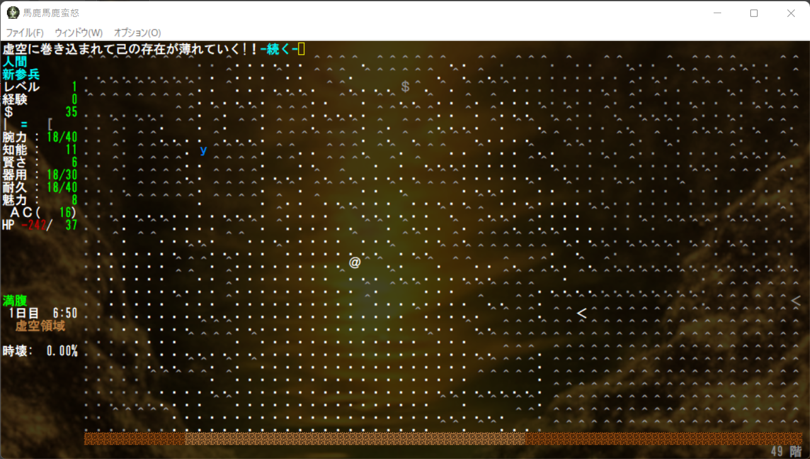
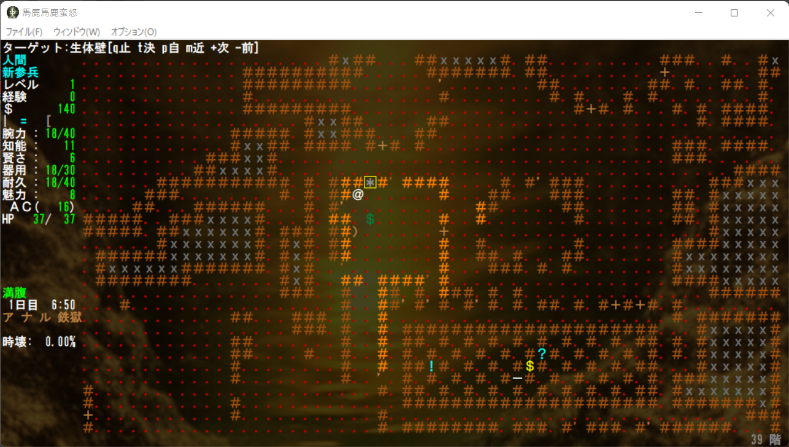
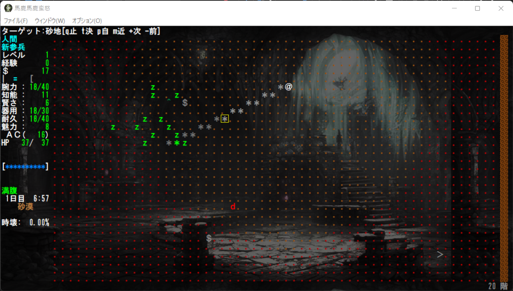
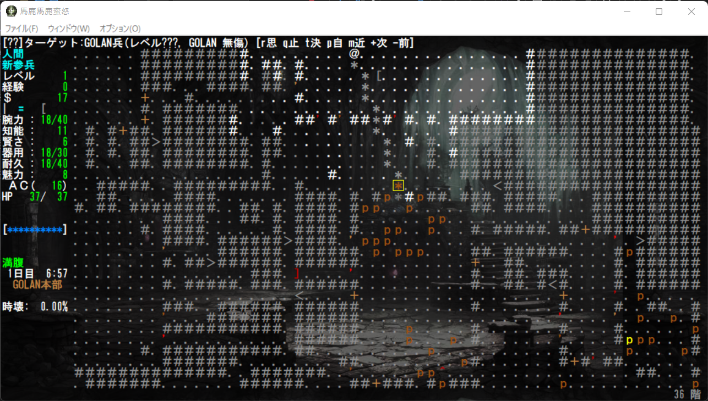

# 核実験用バリアント馬鹿馬鹿蛮怒 --ダンジョン編

本記事は[Roguelike Advent Calendar 2022](http://qiita.com "Roguelike Advent Calendar 2022")の7日目の記事です。
本来馬鹿馬鹿の公式Webにアップする予定でしたがとりあえずGitHubに記事フォルダを作り作成しました。そのうち移すかもしれません。

## 馬鹿馬鹿蛮怒のクッソ汚いダンジョン共

[本サイトのreadme.mdに語っております通り](https://github.com/sikabane-works/bakabakaband#readme)、馬鹿馬鹿蛮怒は*bandバリアントの核実験場を目指して、２割真面目に８割ノリと勢いだけで色んなクッソ汚いダンジョンをぶち込んでいます。まだα版もα版、それも変愚とは違いさらに作りかけの要素ばかりになっていますが、今回はその中でも現状どのようなダンジョンを作りかけているかを紹介いたします。

### 下北沢 ～ホモの聖地～

しょっぱなからお　ま　た　せ。クッソ汚くホモが生成しやすいダンジョンです。最奥には淫夢の始まりたるあの男がガーディアンとして控えています。今後できればもう少し都市っぽい構造になるよう改良したいと思います。

### 百合天国☆ ～43名くらいで集まって出来たヴォイスドラマ企画空間～

ホモに劫掠しつくされた下心丸出しの同人ゴロが作った夢の跡をダンジョン化しました。最奥にはやはり、あの男が控えています。レズモンスターが少ないので、やっぱりクッソ汚いモンスターがはびこりがちです。もう少し幻想郷のまがい物要素をダンジョンに整えたいと思います。

### 虚空領域 ～忘却界や猿空間とも言われる論理すら歪む空間～

Crawlあたりにも似たものがある罰ゲーム空間です。虚無属性のでかいダメージを受ける床に埋め尽くされており、帰還は利用できますが、読んでから効力が出るまでの時間が非常に長くなっています。トラップなどで飛ばされることもあります。

今後もう少し調整と、潜ると危険なりに何か得るものがあるように調整したいと思います。

### 聖杯の迷宮 ～聖杯の生み出す悪夢の迷宮～

Bloodborneをモチーフにしました。馬鹿馬鹿蛮怒中で大量追加されている固定部屋の生成率が極めて高くなっています。今のままでは本来のBloodborne要素にかけているので、やはりまだ調整したいと思います。

### ソープロ農場 ～戦いから追放されたすべての者が行き着く農場～

MtGの名ネタ呪文「剣を鋤に」をネタにしたダンジョンです。まだ同機能は実装できていませんが、反攻撃や反魔法の洞窟どころでなく、一切の攻撃行為ができない平和なダンジョンを目指しています。どういう価値があるのか自分でもまだ分かっていません。何か考えます。

### ア ナ ル 鉄 獄 ～鰌、秋刀魚 肛門虐待直腸破壊!!～

ｱｯｱｯｱｯｱｯｱｯｱｯｱｯｱｯｱｯｱｰ（絶望）某クッソ汚いホモビをモチーフにした生体ダンジョンです。最奥にはホモの玩具にされてクッソ汚い賞を授与された哀れなカエルのマスコットが控えています。

地形以外にも真面目に生体ダンジョンらしいシステムを作りたいところです。

### 砂漠 ～（バグ修正中）～

現在バグでフロア生成にハングアップが起きているので、修正は早めにします。シンプルに部屋や壁の一切ないフロアをダンジョンにし、画面の端から端までを次の階層とする仕組みを作りたいと思います。またフロア自体に熱波のようなペナルティを作るなどの工夫も考えています。

### 雪原 ～（バグ修正中）～

発想や今後の改良は、寒波であることを除いて砂漠とほぼ同じです。

### GOLAN本部 ～アライアンスシステム試験実装～

現在、独自システムの中核にあるアライアンスシステムを踏まえたダンジョンの試験実装です。アライアンスはプレイヤーである＠さん自身が、*bandのクロスオーバー世界の中でだれを敵に回し、誰を味方にするかによって、バランス面でもフレーバー面でもTRPG的な再現を成そうと考えています。本件は名前の通り、北斗の拳の悪の組織の一つ、GOLANの本部にして同名アライアンスのダンジョン、都市であり、彼らのボスを倒すことでアライアンスを「壊滅」させることができます。

## 最後に

（中途半端に実装した物ばっかで）未熟です……はよ仕上げます。
