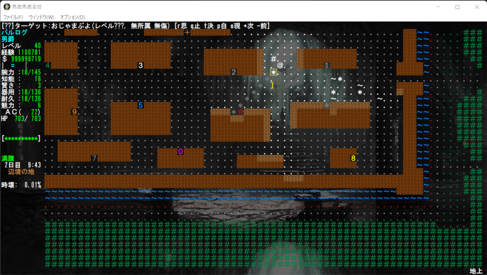
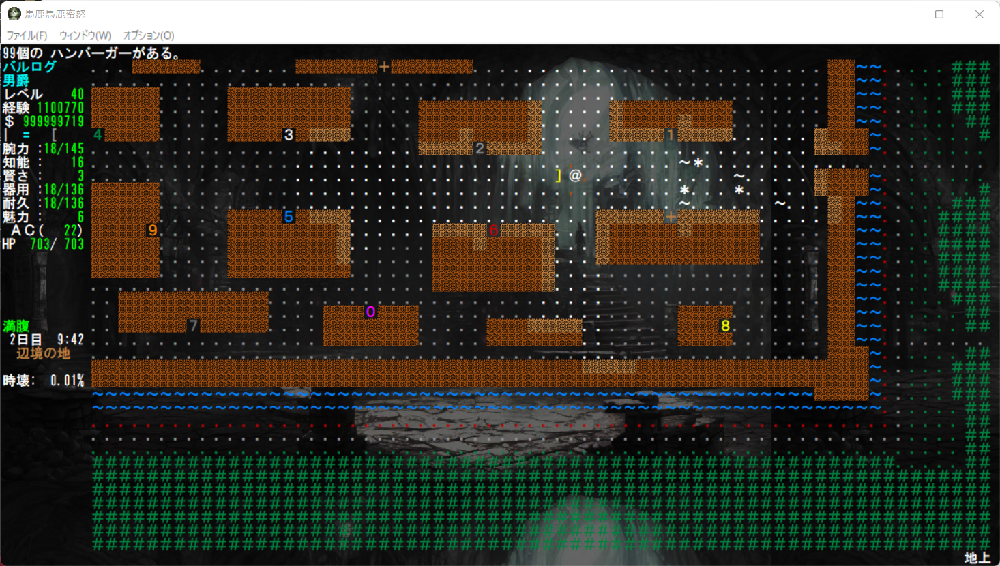

# 核実験用バリアント馬鹿馬鹿蛮怒 --モンスター編2

本記事は[Roguelike Advent Calendar 2022](http://qiita.com "Roguelike Advent Calendar 2022")の12日目の記事です。ええ、遅れました。
前回、前々回同様本来馬鹿馬鹿の公式Webにアップする予定でしたがとりあえずGitHubに記事フォルダを作り作成しました。そのうち移すかもしれません。

### 死亡時特定IDのモンスターを一定確率で一定数生成する能力。

> F:DEAD_SPAWN_X_IN_Y_KIND_NdS

の指定でモンスターが死亡時モンスターを湧かせる仕様を追加しました。
生成メッセージは未実装ですが、本家からのピンク・ホラー、暁の戦士などをハードコーディングからこれで補完することができます。

```
N:1571:固ぷよ
E:Hard puyo
G:#:B
I:107:30d20:15:120:50
W:35:10:0:50:0:0
F:HURT_FIRE | HURT_COLD | HURT_LITE | HURT_ROCK | NEVER_BLOW
F:ATTR_CLEAR | NEVER_MOVE | MULTIPLY |
F:EMPTY_MIND | NO_FEAR | NO_CONF | NO_SLEEP
F:DEAD_SPAWN_1_IN_1_1104_1d1
D:$A mysterious clear and hard cube thing.
D:透明で硬い立方体状の謎の生物だ。
```

```
N:1104:おじゃまぷよ
E:Hindrance puyo
G:j:B
I:108:30d6:15:60:50
W:30:10:0:50:500:1571
F:HURT_FIRE | HURT_COLD | HURT_LITE | HURT_ROCK | NEVER_BLOW
F:ATTR_CLEAR | NEVER_MOVE | MULTIPLY |
F:EMPTY_MIND | NO_FEAR | NO_CONF | NO_SLEEP
D:$A mysterious clear jelly thing.
D:透明でぷよぷよした謎の生物だ。
```

現状は固ぷよがおじゃまぷよに置換される処理に利用しています。




### 死亡時特定IDのアイテムを一定確率でダイス分ドロップする仕様。

変愚でも収録している某マスコットに大量のハンバーガーを所持させました。

```

N:1401:気狂いピエロ『ドネルド・マクドネルド』
E:Roneld McDoneld, the Mad Pierrot
G:h:v
I:120:50d30:20:80:20
W:36:3:0:3000:0:0
B:SHOW:CONFUSE:6d9
B:CHARGE:FIRE:6d9
B:CHARGE:COLD:6d9
B:CHARGE:POISON:6d9
F:UNIQUE | FORCE_MAXHP | MALE | EVIL | ATTR_MULTI | DROP_GREAT | DROP_90
F:STUPID | CAN_SPEAK | WEIRD_MIND | ELDRITCH_HORROR | BASH_DOOR | KILL_BODY
F:IM_FIRE | IM_COLD | IM_POIS | RES_CHAO
F:TAKE_ITEM | CAN_SWIM | NO_CONF | NO_FEAR
F:DROP_KIND_1_IN_1_711_0_10d5
F:DROP_KIND_1_IN_1_711_0_10d5
F:DROP_KIND_1_IN_1_711_0_10d5
F:DROP_KIND_1_IN_1_711_0_10d5
S:1_IN_5 | SCARE | HOLD | CONF | BLIND | BR_CHAO
D:$He is a terrorist at McDoneld's,
D:$ one of the largest military-industrial complexes in the world.
D:$  He has driven various people to gradual death
D:$ due to arteriosclerosis.
D:世界で最も巨大な軍産複合体の一つ、
D:マクドネルド社に籍を置くテロリストだ。
D:彼は様々な人々を動脈硬化によって緩やかな死へと追いやった。
```

```
N:711:ハンバーガー
E:& hamburger
G:,:u
I:80:44:3
A:5/5
W:5:5:2:2
D:マクドネルド社の悪魔の兵器だ。それの過剰摂取はあなたに肥満や動脈硬化などの無数の不衛生をもたらす。
```

御覧の有様だよ！



ハードコーディング的には〈コーン〉の血戮悪魔のカオスブレードドロップなどをそのまま置換できます。

### モンスターの最大生成数の指定

> MOB_*

というフォーマットで最大生成数を指定可能にしました。これは本家変愚のナズグルや鬼殺隊と同様の仕様の実質的拡張であり、いずれ開設予定の「アライアンス」システムにも関わってきます。

```
N:1687:GOLAN兵
E:Soldier of GOLAN
G:p:u
I:110:10d10:25:40:10
W:16:3:0:240:0:0
B:SHOOT:HURT:3d5
B:HIT:HURT:2d8
B:HIT:HURT:2d8
F:BASH_DOOR | OPEN_DOOR | FRIENDS | DROP_90 | WILD_TOWN | WILD_ALL
F:IM_FIRE | IM_POIS | NO_SLEEP | NO_CONF | MOB_500 | ALLIANCE_GOLAN
F:MALE | HUMAN | DROP_CORPSE | DROP_SKELETON | EVIL
S:1_IN_3 |
S:SHOOT
D:世紀末の選民思想的軍集団GOLANの兵士だ。常に周囲で奴隷狩りを繰り返している。
```

いわゆる準ユニーク(UNIQUE2)に近い挙動にもできます。

```
N:1696:オディオマウス
E:Odio mouth
G:#:v
I:120:35d100:34:130:5
W:58:4:0:15000:0:0
B:BITE:HURT:10d14
B:BITE:HURT:10d14
B:BITE:HURT:10d14
B:BITE:HURT:10d14
F:PREVENT_SUDDEN_MAGIC | FORCE_MAXHP | RES_TELE
F:COLD_BLOOD | BASH_DOOR | 
F:EVIL | CAN_FLY | MOB_1 | ALLIANCE_ODIO
F:IM_ACID | IM_FIRE | IM_COLD | IM_ELEC | IM_POIS | RES_NETH |
F:NO_CONF | NO_SLEEP | NEVER_MOVE
S:1_IN_2 | 
S:BR_ABYSS | BR_VOID
D:多数の憎しみ満ちた争いの果て、屍の山の上に姿を現すという憎悪の権化だ。
```

```
N:1693:オディオアイ
E:Odio eye
G:e:v
I:120:30d100:34:130:5
W:55:4:0:12000:0:0
B:SLASH:HURT:10d14
B:SLASH:HURT:10d14
B:GAZE:PARALYZE:10d6
F:PREVENT_SUDDEN_MAGIC | FORCE_MAXHP | RES_TELE
F:COLD_BLOOD | BASH_DOOR | 
F:EVIL | CAN_FLY | MOB_2 | ALLIANCE_ODIO
F:IM_ACID | IM_FIRE | IM_COLD | IM_ELEC | IM_POIS | RES_NETH |
F:NO_CONF | NO_SLEEP | NEVER_MOVE
S:1_IN_2 | 
S:SLOW | MIND_BLAST | BRAIN_SMASH | FORGET | BO_WATE
D:多数の憎しみ満ちた争いの果て、屍の山の上に姿を現すという憎悪の権化だ。
```