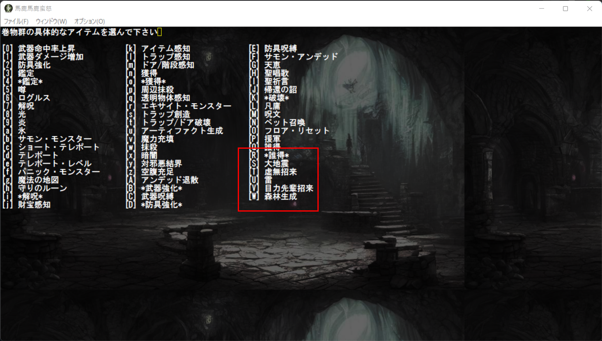
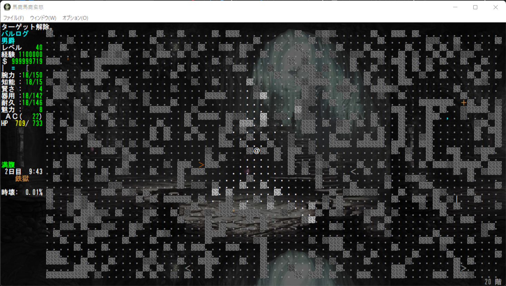
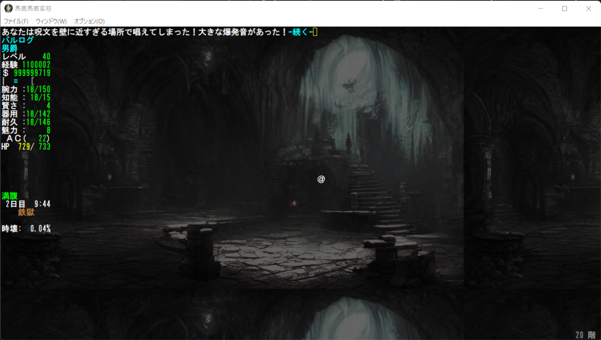
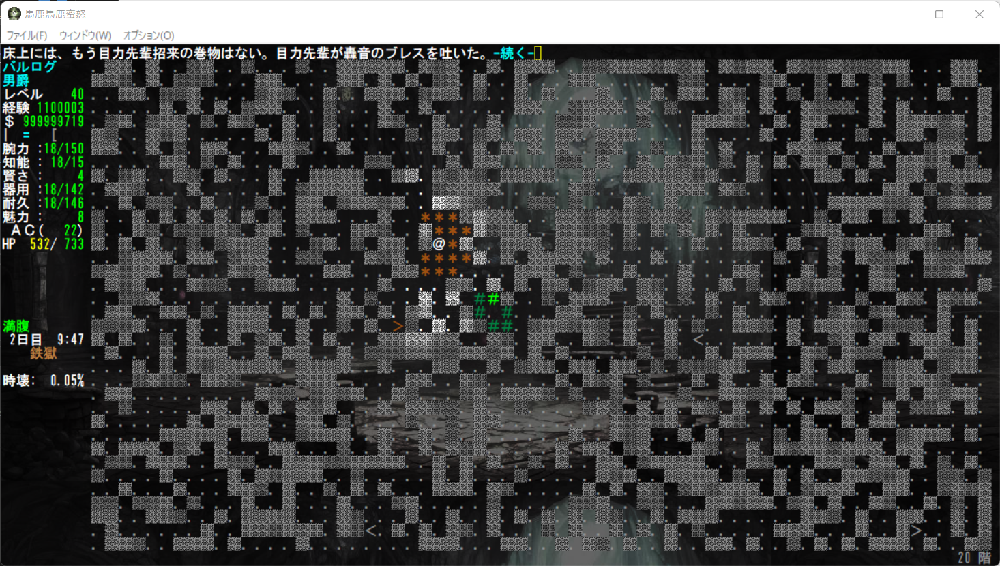
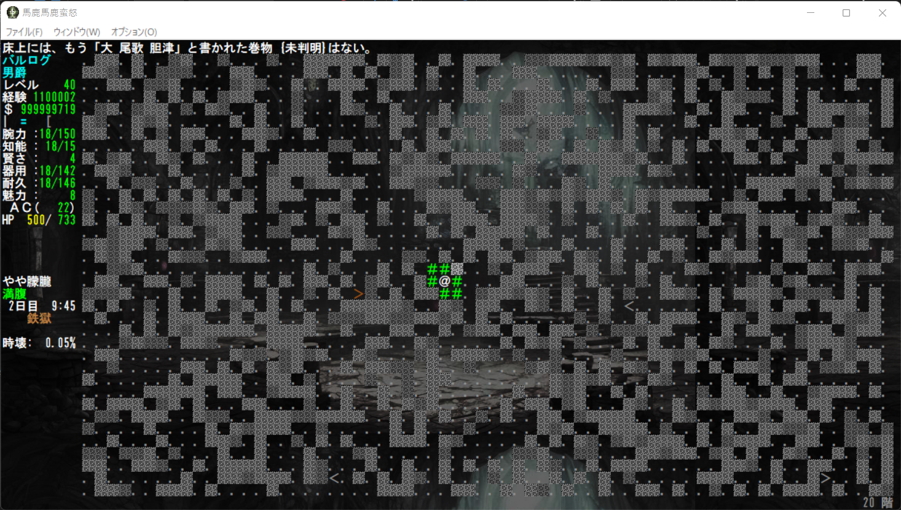

# 核実験用バリアント馬鹿馬鹿蛮怒 --アイテム編2

本記事は[Roguelike Advent Calendar 2022](http://qiita.com "Roguelike Advent Calendar 2022")の14日目の記事です。そういうことになっています。相変わらず占有中です。
例によって本来馬鹿馬鹿の公式Webにアップする予定でしたがとりあえずGitHubに記事フォルダを作り作成しました。そのうち移すかもしれません。

今回は適当に追加した巻物どもを紹介します。

## 追加した巻物

### 大地震の巻物

派手に半径50マスが自身でガタガタになります。

### 虚無招来の巻物

カオス領域の最終魔法が君の手に！使いづらいけんどな。ブヘヘヘヘへ。

### 雷の巻物

炎の巻物、氷の巻物からそのまま安直に増やしました。自分がダメージ受けつつクソデカ電撃ボール生成します。

### 目力先輩招来の巻物

ヌゥン！ヘッ！ヘッ！ア゛ア゛ア゛ア゛ァ゛ァ゛ァ゛ァ゛
ア゛↑ア゛↑ア゛↑ア゛↑ア゛ア゛ア゛ァ゛ァ゛ァ゛ァ゛！！！！
ウ゛ア゛ア゛ア゛ア゛ア゛ア゛ァ゛ァ゛ァ゛ァ゛ァ゛ァ゛ァ！！！！！
フ ウ゛ウ゛ウ゛ゥ゛ゥ゛ゥ゛ン！！！！
フ ウ゛ゥ゛ゥ゛ゥン！！！！

まあ、朦朧ルール変わったので即死ということはないですね。ええ。

### 森林生成の巻物

自然領域の最強魔法も君の手に！（安直）

