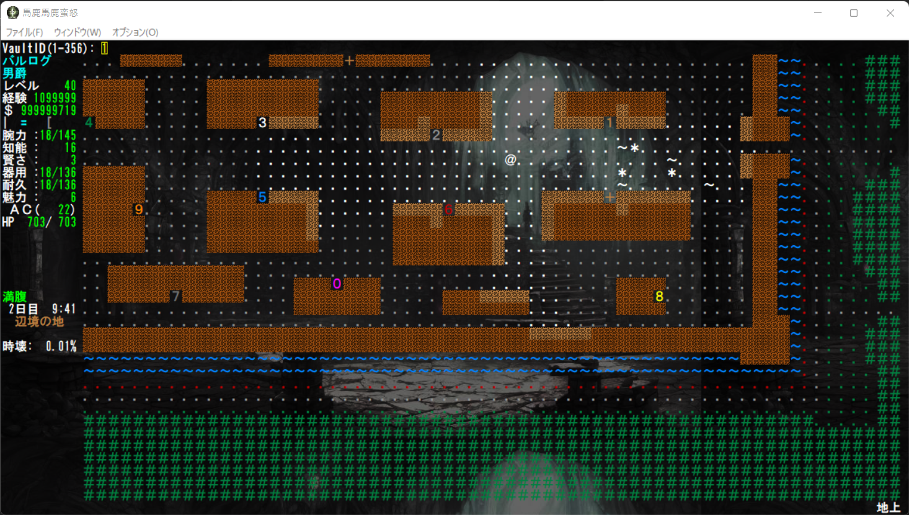
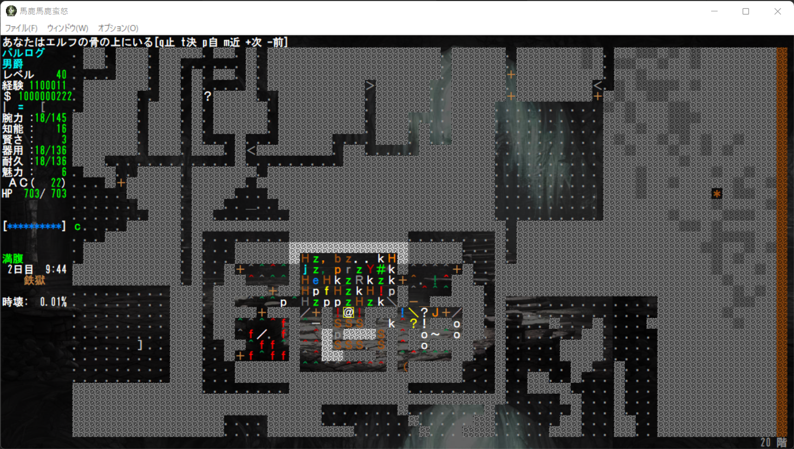
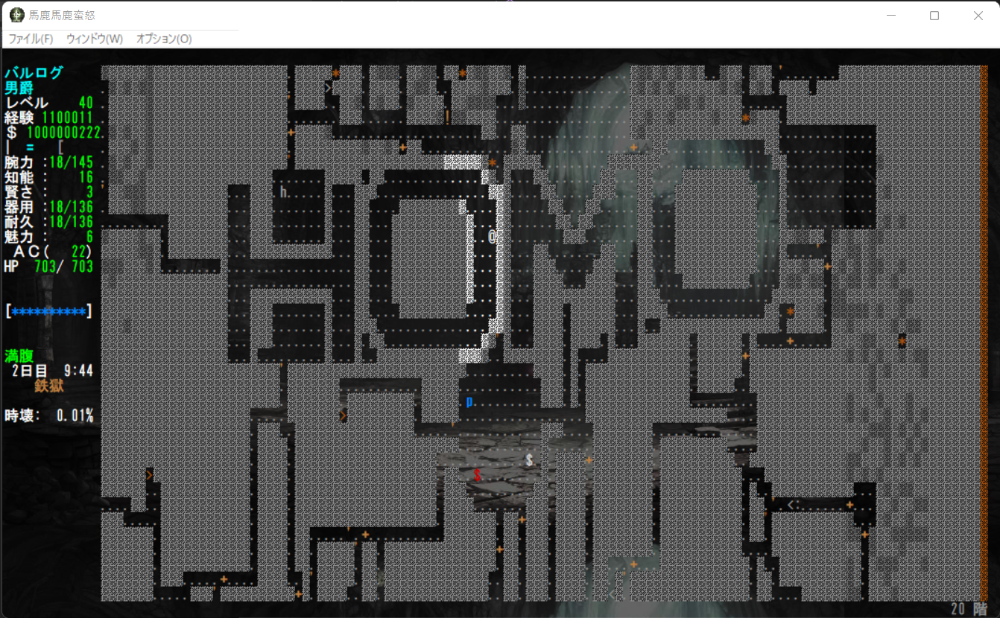
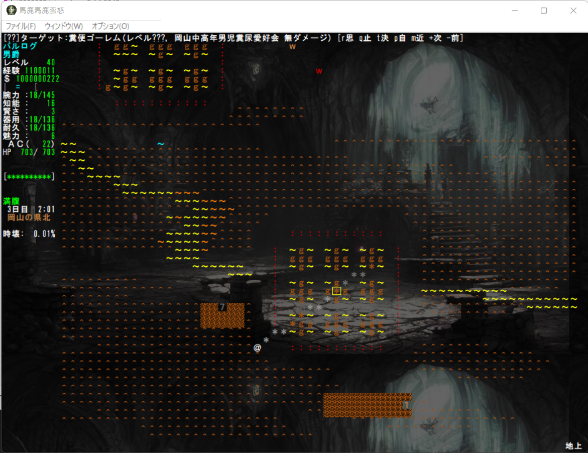

# 核実験用バリアント馬鹿馬鹿蛮怒 --Vault（固定部屋）編

本記事は[Roguelike Advent Calendar 2022](http://qiita.com "Roguelike Advent Calendar 2022")の15日目の記事です。誰かほかに記事書いてくれよ（絶望）
例によって本来馬鹿馬鹿の公式Webにアップする予定でしたがとりあえずGitHubに記事フォルダを作り作成しました。そのうち移すかもしれません。

今回は固定部屋の実験的仕様を紹介します。

## 固定部屋機能の拡張

とりあえずデバッグコマンド「R」でプレイヤーのいる場所にVaultを生成できるようにしました。







## 固定部屋に任意の地形を指定する

Vaultの構成地形やその上のモンスターを従来の十数種類までの構成からアイテムをF:で定義して任意に配置することができるようになりました。

トラップなどの欺瞞地形も望み通りに指定可能です。

```
N:268:糞便ゴーレム部屋
X:17:8:19:19
F:G:303:303:MONSTER_1380
F:H:303:303
F:|:271:271
F:-:300:300
D:  %%%%%%%%%%%%%%%  
D: %%.............%% 
D:%%..|||||||||||..%%
D:%.................%
D:%.|.HGH-HGH-HGH.|.%
D:%.|.GGG-GGG-GGG.|.%
D:%.|.HGH-HGH-HGH.|.%
D:%.|.-----------.|.%
D:%.|.HGH-HGH-HGH.|.%
D:%.|.GGG-GGG-GGG.|.%
D:%.|.HGH-HGH-HGH.|.%
D:%.|.-----------.|.%
D:%.|.HGH-HGH-HGH.|.%
D:%.|.GGG-GGG-GGG.|.%
D:%.|.HGH-HGH-HGH.|.%
D:%.................%
D:%%..|||||||||||..%%
D: %%.............%% 
D:  %%%%%%%%%%%%%%%  
```
## 町の地形に配置する

> V:268:50:50:0:0:0
> V:268:80:70:0:0:0
> V:268:106:40:0:0:0

上記のように指定することで町の中に固定部屋を生成することができるようになっています。糞でかい都市の景観を単純コピーする他、スクリプト分岐で生成区分けできるようになります。


